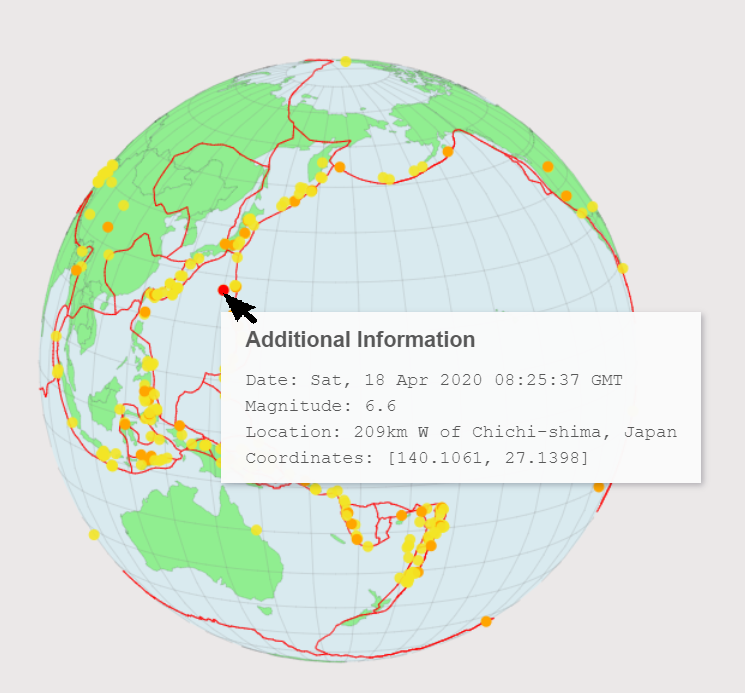

# Earthquake Mapping
An Earthquake mapping applicaton written in HTML and Javascript using USGS data and utilizing the D3 visualization library.

<kbd></kbd>

The United State Geological Survey (USGS) provides a rich set of data on earthquakes, including magnitude, timing, and location. Earthquake Mapping seeks to showcase the data in a simple, easy to understand, and interactive display.

ES6 Promise based code was used since the earthquake, country, and tectonic plate data all come from 3 different sources.

In addition, the slider allows user to interact and filter the earthquakes by magnitude.

Users can also hover on an earthquake location to get additional information.

<kbd></kbd>

